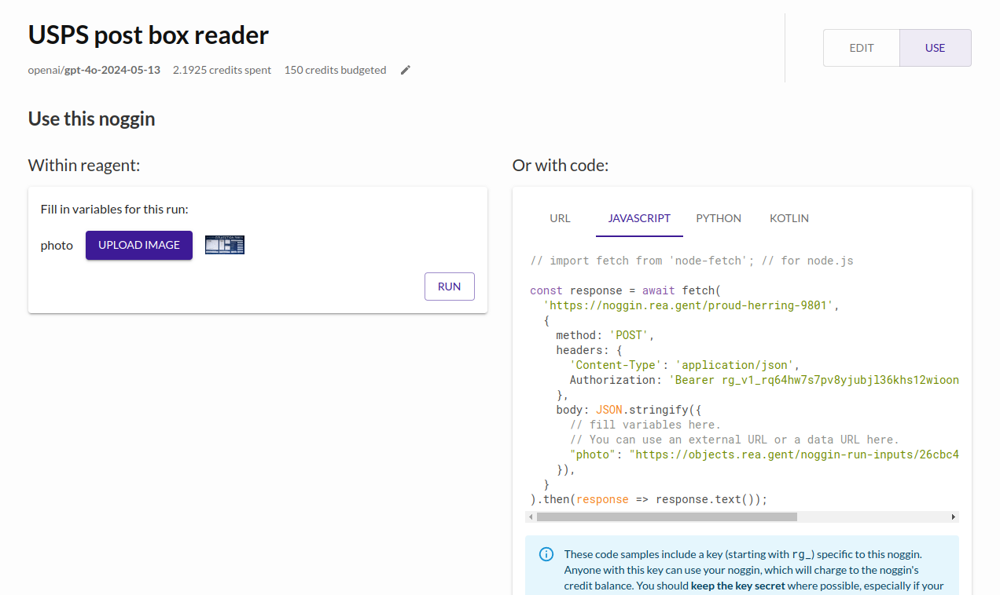
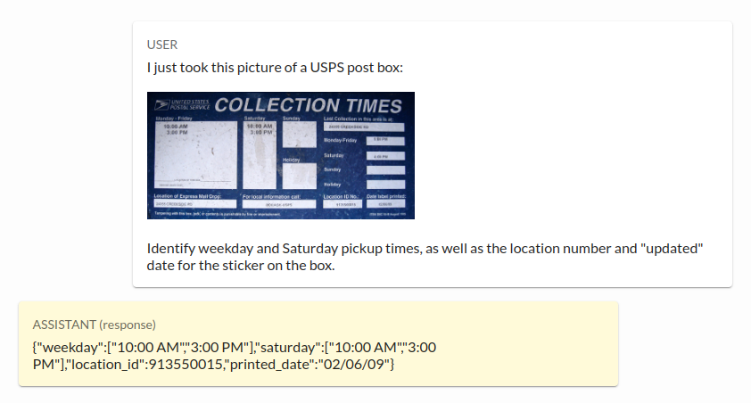
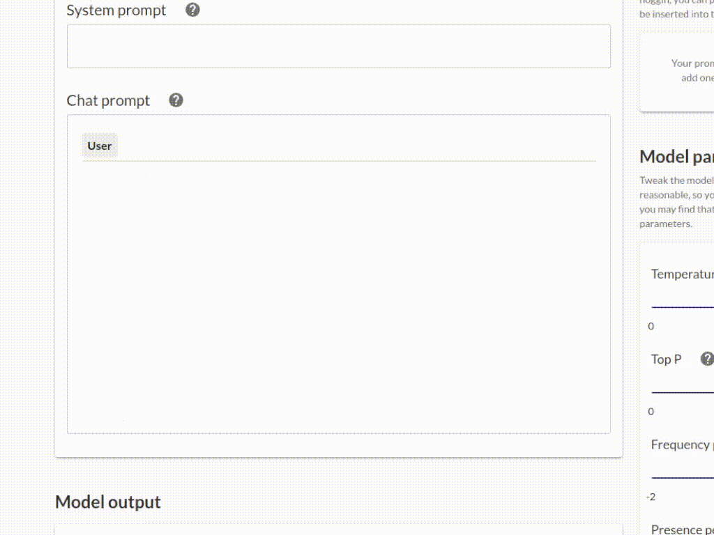
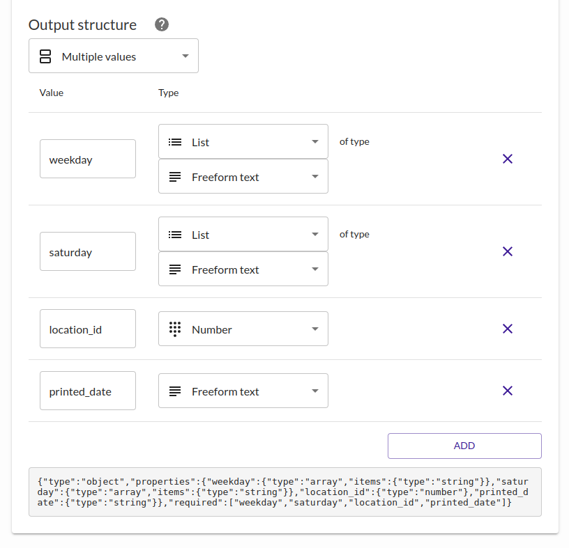
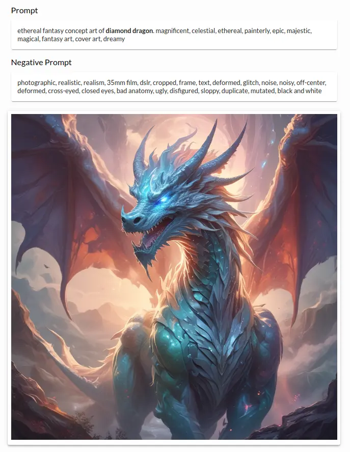
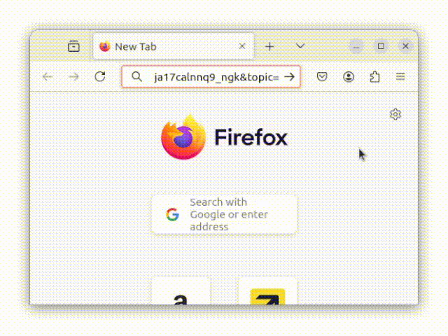
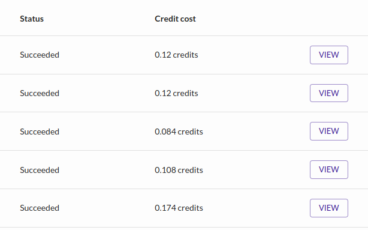

# reagent

reagent is an open-source Web platform designed to facilitate rapid prototyping of AI-backed software for developers.
The platform offers a prompt authoring interface for generative AI models, creating a **hosted API**for each prompt that can be used immediately in software prototypes, with instrumentation that allows for quick debugging and refinement.

## Why?

AI can help us **augment traditional UIs**, rather than just turning everything into a chat text field:

We designed reagent to facilitate the process of integrating AI models into a wide range of software prototypes. See this walkthrough video for our [programming assignment](https://docs.google.com/document/d/1icRnM4s_1evEevnNxXBkORqz7et-GxB-e9VXt5pOEyU/edit) designed to introduce students to reagent and the use of AI models in software prototyping:

## 1. Create a "noggin" to perform a particular task

Use the noggin authoring interface to design a prompt template for a generative AI model.
Specify variables that will be used at runtime to construct the full prompt.

## 2. "Use your noggin" in your software prototype

Experiment within reagent, and once you're satisfied, use the automatically-created hosted API in your own software prototypes.
Any variables you created in your prompt will be input variables in the API.

# 3. Visualize past runs

Visualize all API calls, even those made from your prototype code, to see the exact input and output in the AI call.

## Features

### Rich prompt-editing sandbox

reagent's prompt editor is designed from the beginning for generative AI and offers first-class support for live collaboration. Each model uses a declarative configuration file to customize exactly which fields are present in the editor and how they behave.

reagent includes an "output structure" editor, allowing you to configure the format of the AI output, for supported models.

### Multimodal input and TTI support

reagent and its prompt sandbox are designed from the ground up to support inputs and outputs of various formats, meaning it's easy to prototype with the latest AI models.

reagent is provider-agnostic, provided the right adapters are implemented in `noggin-server`. Currently supported are [OpenAI](https://openai.com/) models, [Anthropic](https://www.anthropic.com/) models, and open-source models like Llama provided by [Replicate](https://replicate.com/).

### Automatic streaming output

Hosted APIs can automatically stream their output, where supported by the backing AI model.

### Budgeting and per-request cost tracking

When providers support cost calculation, reagent keeps track of how much each request costs and can cut off access before racking up a big bill.

### Tools for instructors and team managers

Instructors can create an organization and team up students, setting individual or shared budgets to fund their students' innovation. Teaching assistants can poke in to observe students' prompt engineering and help them debug.
Students never need to configure API keys or billing, and LTI support means students can log in through their LMS and be automatically enrolled into an organization.

## How to build

(these instructions are super bare at the moment; reach out to tja@berkeley.edu if you're trying to set up a development environment)

- copy .env.example to .env and create a secret
- `cd gen-websocket-keys && ./gen.sh`
- `docker compose up`
- `dev-utils/prisma-remix.sh db push`
- `dev-utils/prisma-remix.sh db seed`
- you may need to play around to get minio to work; there's a script in `minio/init-buckets.sh` that you can run in the Docker container to configure the object storage buckets.
